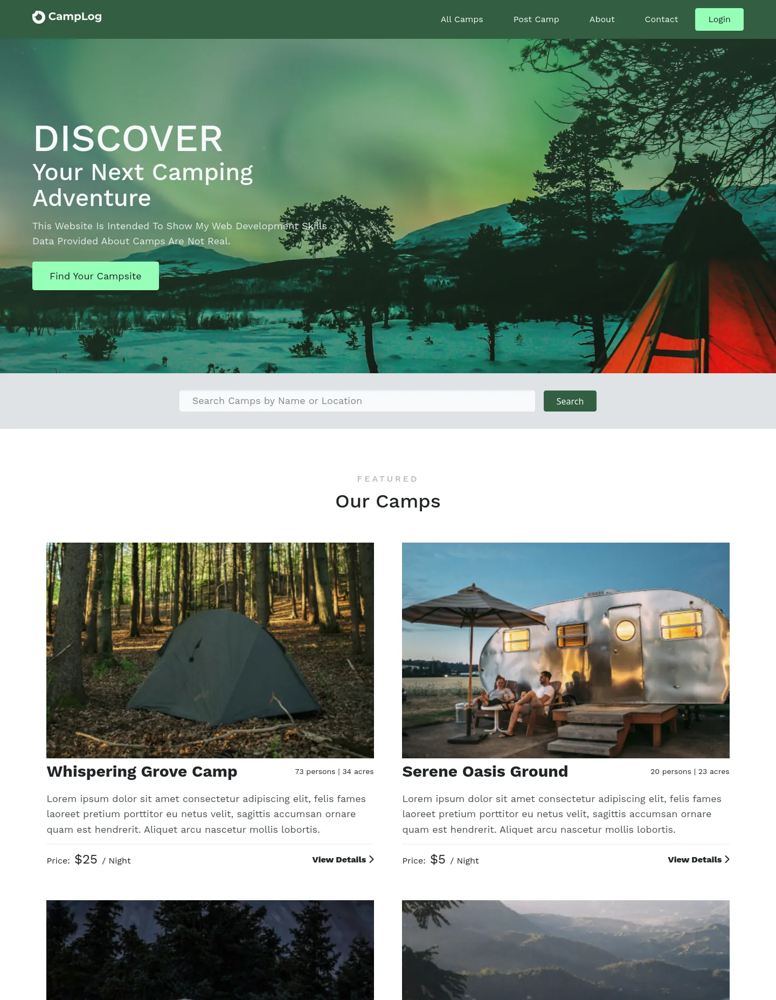

# Camp Log

Camp-log is about sharing data about the Camps all around the world and also Campers experience. Post your experience and search for the nearest camp to you. You can also share your experience with the world and help others to find the best camps.

## Technologies Used

- Express.js
- EJS
- MongoDB
- Mongoose
- Passport.js
- Mapbox

## Features

- Full CRUD functionality for Camps and Reviews.
- Image upload using Cloudinary.
- User Authentication and Authorization.
- Camp Search using Name and Location.
- Google captcha integration for security.
- and more...

## Project Dependencies

- Windows, MacOS, or Linux
- Node.js
- NPM
- MongoDB
- Chrome or any other modern browser
- Cloudinary and Mapbox accounts (for running locally)

## Run Locally

1. Clone the project

```bash
git clone https://github.com/shariult/camp-log.git
```

2. Navigate to the project directory

```bash
cd camp-log
```

3. Install dependencies

```bash
npm i
```

4. Copy ".env.template" to ".env". To run in Development mode and set the environment variables in the ".env" file.

5. Run the project in development mode,

```bash
npm run dev
```

## 📬 Let's Connect & Collaborate!

I am currently open to freelance projects, remote positions, and collaborative opportunities.

[](https://shariul.com) [](https://www.linkedin.com/in/shariul/) [](https://discord.gg/9q5GRgVS2)

## Screenshots


